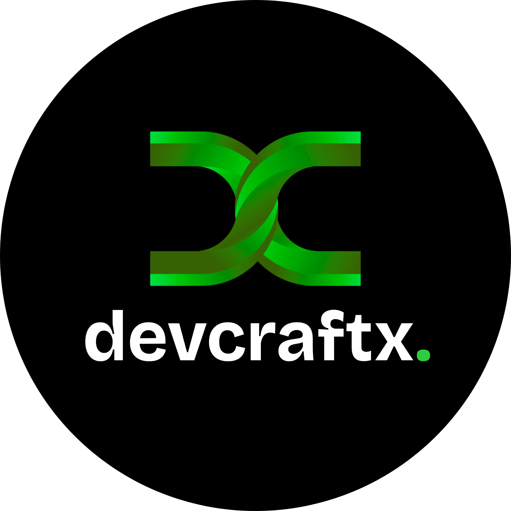

# DevCraftX – Internship & Summer Training Platform

**Transform Your Tech Career. Craft Your Future.**

Explore internships and summer training programs designed to accelerate your development journey.

[Visit Platform](#) • [Explore Programs](#) • [Get Certificate](#)

---

## About DevCraftX

DevCraftX is a premium platform connecting aspiring developers with carefully curated internship and summer training opportunities. We bridge the gap between academic learning and real-world industry experience, empowering the next generation of tech professionals.

### Our Mission

To democratize access to high-quality tech internships and training, enabling students and early-career developers to gain practical experience, build portfolios, and launch successful careers in technology.

---

## 🌟 Key Features

### 📚 Curated Programs
- **Internship Programs** – Real-world experience with leading tech companies
- **Summer Training** – Intensive skill development bootcamps
- **Certification Courses** – Industry-recognized credentials
- **Mentorship Opportunities** – Guidance from experienced professionals

### 🎯 Why Choose DevCraftX?

✅ **Industry Connections** – Direct pathways to top tech companies  
✅ **Expert Mentors** – Learn from experienced professionals  
✅ **Skill Development** – Hands-on training in current technologies  
✅ **Career Support** – Resume reviews, interview prep, job placement assistance  
✅ **Flexible Learning** – Full-time, part-time, and self-paced options  
✅ **Verified Certificates** – Recognized credentials in the tech industry  

---

## 🚀 Getting Started

1. **Explore Programs** – Browse our curated selection of internships and training programs
2. **Create Your Profile** – Set up your profile and showcase your skills
3. **Apply** – Submit applications to programs that match your goals
4. **Learn & Grow** – Engage with mentors, complete projects, and build your portfolio
5. **Get Certified** – Earn recognized credentials and boost your career

---

## 📊 By The Numbers

- **500+** Active Internship Programs
- **1000+** Successful Placements
- **50+** Partner Companies
- **95%** Program Completion Rate
- **8.5/10** Average Student Rating

---

## 💼 Featured Programs

### Web Development Internship
Full-stack development experience with cutting-edge technologies including React, Node.js, and cloud deployment.
- **Duration:** 12 weeks  
- **Level:** Intermediate  
- **Spots:** Limited

### Mobile App Development Training
Master iOS and Android app development from fundamentals to deployment.
- **Duration:** 8 weeks  
- **Level:** Beginner to Intermediate  
- **Spots:** Open

### Data Science Bootcamp
Learn data analysis, machine learning, and data visualization with real datasets.
- **Duration:** 10 weeks  
- **Level:** Intermediate  
- **Spots:** Limited

### Cloud Engineering Summer Program
Get hands-on with AWS, GCP, and Azure in this intensive cloud computing track.
- **Duration:** 6 weeks  
- **Level:** Intermediate to Advanced  
- **Spots:** Open

---

## 👥 Our Team

Dedicated to your success, our team combines industry expertise with passion for education.

- **Founders & Leadership** – Tech industry veterans with 50+ years combined experience
- **Mentors** – Senior engineers and architects from FAANG companies
- **Career Coaches** – Former recruiters specializing in tech hiring
- **Learning Specialists** – Experts in tech education and curriculum design

---

## ��� Success Stories

> *"DevCraftX transformed my career. I went from student to junior developer at a startup within 6 months. The mentorship and hands-on projects were invaluable."*  
— **Sarah Chen**, Software Engineer, TechStartup Inc.

> *"The internship placement rate is incredible. I landed my dream role before the program even ended!"*  
— **Raj Patel**, Full Stack Developer, Design Agency

> *"Great community, excellent mentors, and relevant curriculum. Highly recommend!"*  
— **Emma Rodriguez**, Junior Product Manager, Tech Corp

---

## 🛠️ Tech Stack

The DevCraftX platform is built with modern, scalable technologies:

- **Frontend:** HTML5, CSS3, JavaScript (Responsive Design)
- **Design:** Clean, dark UI with green accent theme
- **Performance:** Optimized for all devices (mobile, tablet, desktop)
- **Accessibility:** WCAG compliant, keyboard navigation support

---

## 📖 Curriculum Highlights

### Core Learning Areas
- **Programming Fundamentals** – Languages and paradigms
- **Web Technologies** – Frontend and backend development
- **Mobile Development** – iOS and Android ecosystems
- **Cloud & DevOps** – Infrastructure and deployment
- **Data Science** – Analytics and machine learning
- **Soft Skills** – Communication, teamwork, professional development

### Learning Methodology
- **Project-Based Learning** – Real-world challenges and applications
- **Mentorship** – 1-on-1 guidance and code reviews
- **Collaboration** – Team projects and peer learning
- **Industry Exposure** – Guest lectures from tech leaders
- **Portfolio Building** – Showcase your best work

---

## 📋 Requirements & Eligibility

### General Requirements
- Basic computer literacy
- Passion for technology and learning
- Commitment to complete the program
- Reliable internet connection

### Program-Specific Prerequisites
- Check individual program pages for specific skill requirements
- Some programs require prior programming knowledge
- Entry-level programs welcome beginners

---

## 💬 Testimonials & Reviews

**Average Rating: 8.5/10**

"The structure is perfect for someone transitioning into tech. The projects are challenging but doable."

"Best investment I made in my career. The network alone is worth it!"

"Mentor support was exceptional. They really cared about my growth."

---

## 📞 Contact & Support

### Get in Touch
- **Email:** info.devcraftx@gmail.com
- **Support:** info.devcraftx@gmail.com
- **Phone:** +91 63878 00143
### Quick Links
- [FAQ](#) – Frequently asked questions
- [Blog](#) – Industry insights and tutorials
- [Community](#) – Connect with other learners
- [Careers](#) – Join our team

---

## 🤝 Partnership & Sponsorship

Interested in partnering with DevCraftX or sponsoring a program?

📧 Contact: info.devcraftx@gmail.com

---

## 📄 License

This project is licensed under the MIT License - see the LICENSE file for details.

---

## 🔗 Connect With Us

  
  
  

---

**Made with ❤️ by DevCraftX Team**

*Empowering the next generation of tech professionals*

